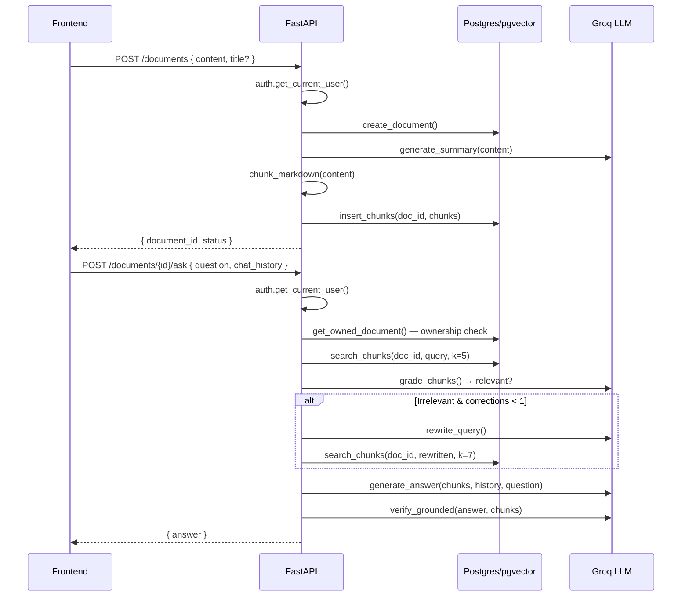

# Architecture

## Overview

AskmyMD is a document Q&A application: users upload markdown documents, which are chunked, embedded, and stored in Postgres with pgvector. Questions are answered via a corrective-RAG pipeline that retrieves relevant chunks, grades their relevance with an LLM, optionally rewrites the query, generates an answer, and verifies grounding against the source material.

## Data Flow

```
User uploads markdown content
        │
        ▼
POST /documents
  ├─ db.create_document()          → row in `documents` table
  ├─ llm_service.generate_summary() → cached Groq summary on the document
  ├─ rag_service.chunk_markdown()   → split into ~1000-char chunks
  └─ db.insert_chunks()            → embed (all-MiniLM-L6-v2) + store in `chunks` table (pgvector)
        │
        ▼
POST /documents/{id}/ask
  ├─ db.ensure_chunks()            → backfill if zero chunks exist
  ├─ rag_service.run_corrective_rag()
  │     ├─ _retrieve_step()        → pgvector: ORDER BY embedding <=> :query_vec LIMIT k
  │     ├─ _grade_step()           → llm_service.grade_chunks() — are chunks relevant?
  │     ├─ _rewrite_step()         → llm_service.rewrite_query() — improve retrieval query
  │     ├─ _generate_step()        → llm_service.generate_answer() — draft answer from chunks
  │     └─ _verify_step()          → llm_service.verify_grounded() — check claims against source
  └─ returns ChatResponse(answer)
```

## Key Services

| File | Responsibility |
|------|---------------|
| `backend/app/services/rag_service.py` | Markdown chunking (`chunk_markdown`), embedding model (lazy `SentenceTransformer`), LangGraph corrective-RAG state machine (`run_corrective_rag`, `_build_chat_graph_for_document`) |
| `backend/app/services/llm_service.py` | Groq API calls via LangChain: `generate_summary`, `grade_chunks`, `rewrite_query`, `generate_answer`, `verify_grounded`. Centralizes all LLM interactions and the model name (`openai/gpt-oss-120b`) |
| `backend/app/db.py` | Document/chat/chunk/image CRUD. `search_chunks` does pgvector cosine-distance retrieval. `insert_chunks` calls `_get_embedder` to produce vectors before storing |
| `backend/app/database.py` | SQLAlchemy engine creation from `DATABASE_URL`. Lazy singleton, normalizes `postgresql://` → `postgresql+psycopg://`, auto-appends SSL for Supabase |
| `backend/app/db_models.py` | Declarative ORM models: `Document`, `Chunk` (384-dim pgvector), `Image` (bytea), `ChatMessage` |
| `backend/app/auth.py` | Header-based auth dependency: `Authorization: Bearer <user_id>` or `X-User-Id: <user_id>`. No JWT, no database — user_id is the raw string |
| `backend/app/errors.py` | Unified `{ error, code }` error shape. Domain error helpers (`document_not_found`, `llm_unavailable`, etc.) and FastAPI exception handlers |
| `backend/app/models.py` | Pydantic request/response schemas: `CreateDocumentRequest`, `ChatRequest`, `ChatResponse` |
| `backend/app/routers/documents.py` | All document-scoped routes under `/documents` prefix |
| `backend/app/routers/health.py` | `GET /health` |

## Stack

- **Backend:** FastAPI + Python 3.12
- **Database:** PostgreSQL + pgvector extension (via SQLAlchemy 2.0 + psycopg v3)
- **Embeddings:** `sentence-transformers` (`all-MiniLM-L6-v2`, 384 dims)
- **LLM:** Groq API (`openai/gpt-oss-120b`) via LangChain
- **RAG graph:** LangGraph (retrieve → grade → rewrite/generate → verify)
- **Frontend:** React + TypeScript (Vite dev server on `:5173`)

## Auth Model

Header-based, no JWT. The `get_current_user` dependency reads:
- `Authorization: Bearer <user_id>` — user_id taken as-is
- `X-User-Id: <user_id>` — convenience fallback

There is no password, token signing, or database lookup. The user_id is an opaque string. This is intentional for personal/demo use. See [SECURITY.md](../SECURITY.md) for caveats and production recommendations.

## Request Flow (Mermaid)



## Folder Structure

```
backend/
├── app/
│   ├── main.py              # FastAPI entrypoint, lifespan, CORS
│   ├── auth.py              # Header-based auth dependency
│   ├── database.py          # SQLAlchemy engine/session setup
│   ├── db.py                # Document/chunk/image CRUD + pgvector search
│   ├── db_models.py         # ORM models (Document, Chunk, Image, ChatMessage)
│   ├── errors.py            # Unified error shape + exception handlers
│   ├── models.py            # Pydantic request/response schemas
│   ├── routers/
│   │   ├── documents.py     # /documents/* endpoints
│   │   └── health.py        # /health
│   └── services/
│       ├── llm_service.py   # Groq LLM calls (summary, grade, rewrite, answer, verify)
│       └── rag_service.py   # Chunking + LangGraph corrective-RAG flow
├── tests/
│   ├── conftest.py
│   ├── test_resync.py
│   └── test_summary.py
├── requirements.txt
└── .env.example

frontend/
├── src/
│   ├── App.tsx
│   ├── main.tsx
│   ├── api.ts               # Backend API client
│   ├── storage.ts           # Local storage helpers
│   ├── imageStore.ts        # Image handling
│   ├── components/
│   │   ├── ChatPanel.tsx
│   │   ├── Editor.tsx
│   │   ├── Preview.tsx
│   │   ├── Header.tsx
│   │   ├── FormattingToolbar.tsx
│   │   ├── ResizableSplit.tsx
│   │   └── mermaidToolbar.ts
│   ├── styles/
│   └── fonts.ts
└── package.json
```
